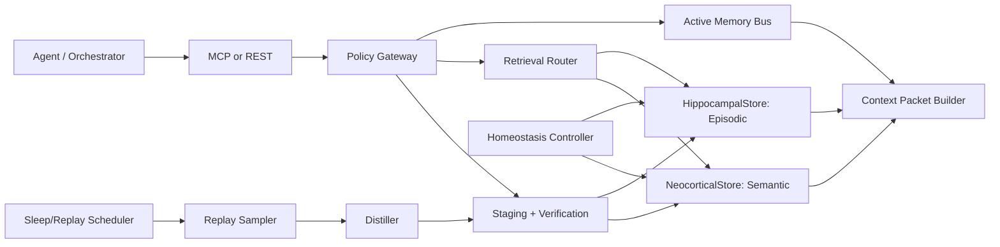
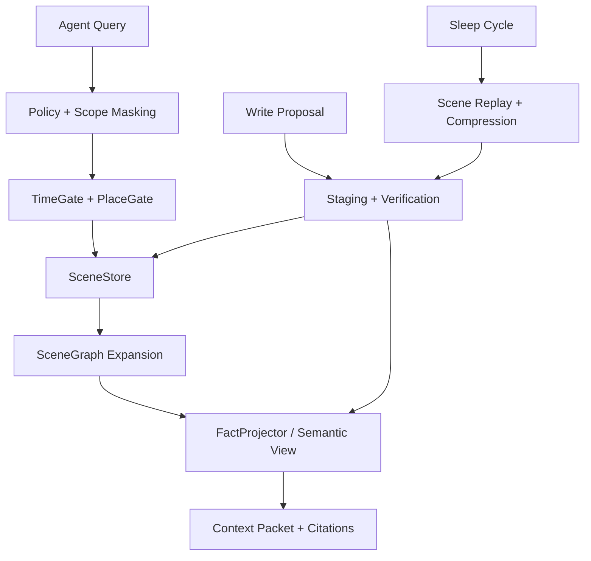
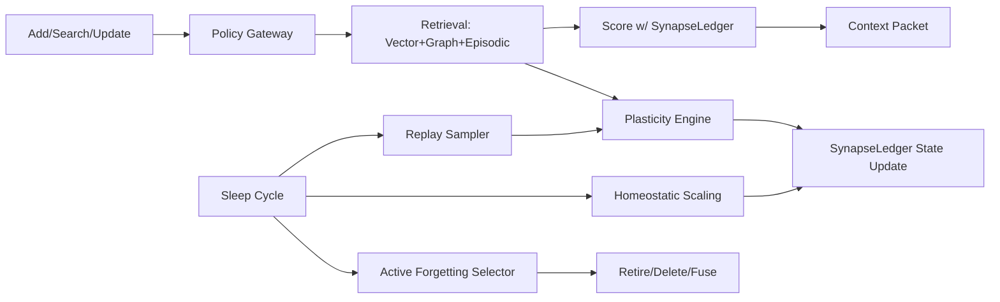

# Human-brain-inspired memory layer design for AI agents grounded in the Engram project

## Executive summary

Engram (the repository at entity["company","GitHub","code hosting platform"]) is already closer to “brain-like” memory than typical vector-store wrappers because it explicitly separates **Active (conscious) memory** from **Passive (subconscious) memory**, adds **episodic scene structure**, and treats memory as a **lifecycle** with staging, trust, masking, consolidation, and decay. citeturn23view0turn24view0turn24view2

However, when judged against how biological memory actually works, three architectural gaps stand out:

First, biological memory is not “one store with scores”; it is **multiple interacting systems** (sensory buffers, working memory, hippocampal episodic encoding, neocortical semantic extraction, and striatal/cerebellar procedural learning) with different **timescales and write rules**. citeturn31search1turn15search2turn15search9turn19search8

Second, durable knowledge in brains emerges through **systems consolidation**: rapid hippocampal storage plus slow neocortical integration, often via offline replay and sleep-associated dynamics. citeturn15search7turn18search0turn16search6turn17search0

Third, brains prevent overload and interference using **pattern separation/completion**, multi-timescale plasticity, and active forgetting/homeostatic mechanisms—not only exponential decay. citeturn17search6turn21search4turn21search0turn18search31

This report proposes three pluggable “memory layer” variants that keep Engram’s public surface (MCP/REST + Python SDK) but deepen biological grounding:

**Variant A (recommended default)**: *CLS Distillation Memory* — explicit hippocampus–neocortex split: append-only episodic store + replay-driven semantic distillation + contradiction-aware canonicalisation.

**Variant B (recommended for multi-agent coordination + temporal reasoning)**: *Scene Graph + Spatiotemporal Index* — CAST++ scenes become first-class nodes in a graph with “time/place/topic” gating and scene-to-fact provenance as the main retrieval spine.

**Variant C (recommended for long-running agents and continual learning)**: *Multi-timescale Synapse Ledger* — each memory has a Benna–Fusi-style multi-timescale strength state and homeostatic control; retrieval and forgetting become dynamics, not static scores.

All three variants preserve Engram’s strengths: scoped access (“all-but-mask”), staged writes with trust, and active signal bus. citeturn23view1turn24view2turn24view0

## Engram repository review

Engram positions itself as a “Personal Memory Kernel” shared across agents, emphasising active + passive memory, agent handoffs, staged writes, and biologically-inspired forgetting; it also warns it is early-stage and subject to API change. citeturn29view0 The repository structure indicates a Python core (`engram/`), integrations/plugins (`plugins/engram-memory`), and test coverage (`tests/`). citeturn22view0

At a system level, Engram’s architecture diagram shows: agents connect via MCP server or REST API; a **Policy Gateway** enforces scopes/masking/quotas/capability tokens/trust; and the system splits into **Active Memory**, **Retrieval Engine**, and **Ingestion Pipeline**, with staged writes, long-term store, indexes (vector + graph + episodic), and a FadeMem garbage-collection/decay loop. citeturn23view1

### Components and data flows

**Active Memory (signal bus).** Engram implements a “conscious” shared state/event/directive bus using SQLite in WAL mode for concurrency, with multiple TTL tiers. Tool responses auto-include current signals (an `_active` field), and a consolidation engine can promote important signals into passive memory. citeturn24view0turn14view0

**Passive Memory stack.** Engram’s README describes a stack including:

- **FadeMem** decay and SML→LML promotion driven by time + access patterns, with reference-aware retention. citeturn24view0  
- **EchoMem** multi-path encoding (raw/paraphrase/keywords/implications/question-forms), described as increasing retrieval surface area and modulating strength for “deep” memories. citeturn24view0  
- **CategoryMem** dynamic category trees that evolve and decay. citeturn24view0  
- **CAST Scenes** episodic memory that clusters interactions by time/place/topic with characters, synopsis, and links to extracted semantic memories. citeturn24view0  
- **Handoff bus** for zero-intervention cross-agent continuity, with lifecycle checkpointing and compatibility tools retained. citeturn24view1turn24view2  

**Read path.** Search calls (`search_memory` or `POST /v1/search`) go through the Policy Gateway, then do **dual retrieval** (semantic + episodic in parallel). Results that match in both are boosted (“intersection promotion”), returning a token-budgeted “context packet” with scene citations. citeturn24view2turn14view0

**Write path.** Writes are treated as “agent proposals” landing in staging (SML) with provenance (agent/time/scope/trust score). Verification includes contradiction checks (invariants), deduplication, and PII risk screening; high-trust agents may auto-merge while others wait for approval/digest. citeturn24view2turn23view0

**Sleep-cycle maintenance.** The REST API includes a sleep-cycle endpoint (`POST /v1/sleep/run`) that can apply decay and clean up stale references. citeturn29view1

### APIs and integration surface

Engram exposes both MCP and REST. The README lists MCP tools spanning active signals, passive memory CRUD/search, memory decay, scenes, and handoff operations; it also notes tool responses include `_active` signals. citeturn14view0turn24view0

The REST API includes session-minting (`POST /v1/sessions`) producing capability tokens with allowed scopes/capabilities, plus endpoints for write proposals (`POST /v1/memories`), search (`POST /v1/search`), staging review/approve, handoff resume/checkpoint, and the sleep-cycle run. citeturn14view0turn29view1

Python SDK entry points shown in the README include `Engram()` for a simplified interface and `Memory()` for a fuller interface (CRUD, promote/demote/fuse/decay/history; active bus; knowledge graph traversal; category operations), with an async context manager (`AsyncMemory`). citeturn29view2turn14view1

### Storage, indexing, and concurrency

Engram supports multiple embedding/LLM backends (default Gemini; options include OpenAI and Ollama) and multiple install profiles, including `sqlite-vec` for concurrent multi-agent vector search without requiring an external server. citeturn23view0turn14view2

A key operational limitation is explicitly called out: local Qdrant “file mode” is single-process and can cause “already accessed” lock errors; the suggested mitigation is switching to the sqlite-vec provider (WAL mode) or using hosted/shared Qdrant. citeturn29view2

### Practical limitations and “assumed unspecifieds”

The README itself flags Engram as early-stage and non-production. citeturn29view0 Beyond that, several constraints are implied but not fully specified in the surfaced docs:

Consistency semantics are not fully described for multi-index writes (vector + graph + episodic) or for staged-write promotion; absent explicit design, this is likely best treated as eventual consistency across indexes with strong consistency on canonical memory IDs and provenance (recommendation, not a claim). citeturn23view1turn24view2

Retrieval “hybrid+graph+categories” is named but not formally specified as a scoring function; similarly, “trust scoring” and “invariant contradiction checks” are described as steps but details (LLM vs rules, deterministic vs probabilistic) are not fully published in README (assumption based on partial spec). citeturn23view1turn24view2

## Neuroscience primer on how the human brain implements memory

Modern neuroscience treats memory as **multiple systems** supported by distinct circuits, rather than a single faculty. citeturn31search1 This section summarises the most load-bearing mechanisms that translate well into AI memory architecture.

image_group{"layout":"carousel","aspect_ratio":"16:9","query":["hippocampus anatomy diagram medial temporal lobe","prefrontal cortex working memory brain diagram","basal ganglia habit learning diagram","hippocampal sharp-wave ripple replay sleep diagram"],"num_per_query":1}

### Memory systems and representations

**Sensory memory** holds raw impressions briefly (e.g., iconic memory for vision). A classic demonstration is Sperling’s partial-report paradigm showing more information is briefly available than can be reported, implying a high-capacity, rapidly decaying visual store. citeturn19search1

**Working memory** is a limited-capacity system for maintaining/manipulating information online. The influential Baddeley–Hitch model includes a central executive plus domain-specific buffers, later extended with an episodic buffer. citeturn15search2

**Long-term declarative memory** (facts and events) depends critically on medial temporal lobe structures including the hippocampus and adjacent cortices. Evidence for hippocampal necessity comes from severe anterograde amnesia after bilateral medial temporal lobe surgery (the classic Scoville–Milner report). citeturn15search8 A broader synthesis of lesion and animal work describes the medial temporal lobe memory system and its components. citeturn31search0

Within declarative memory, **episodic** (events) and **semantic** (general knowledge) memory are commonly distinguished and have different behavioural/neurological signatures. citeturn15search9

**Non-declarative/procedural memory** supports skills and habits and relies heavily on basal ganglia and related circuits; habit formation has been reviewed extensively in the context of basal ganglia function. citeturn19search8 A classic dissociation is intact skill learning (mirror-reading) in amnesia despite impaired explicit recall, supporting “knowing how” vs “knowing that”. citeturn31search2

### Encoding, consolidation, retrieval, and hippocampus–neocortex interaction

Memory formation is typically analysed as **encoding → consolidation → retrieval**, with consolidation including both fast “synaptic” phases and slower “systems” reorganisation. citeturn18search1 Systems consolidation research emphasises how remote memories become organised across cortical networks over time. citeturn18search0

The **Complementary Learning Systems (CLS)** framework provides a computationally explicit account: the hippocampus learns quickly with sparse representations to reduce interference; the neocortex learns slowly, integrating across episodes to extract shared structure (a route from episodic experiences to semantic knowledge). citeturn15search7turn15search26

The hippocampus encodes key “dimensions” for episodes:

- **Space**: place cells fire in location-specific patterns (O’Keefe–Dostrovsky). citeturn32search2  
- **Time**: “time cells” encode successive moments across temporal gaps, supporting sequence/temporal organisation of experience. citeturn32search4turn32search0

These findings align with Engram’s CAST scene axes (time/place/topic) as a plausible engineering abstraction of hippocampal indexing. citeturn24view0turn32search2turn32search4

### Synaptic plasticity, replay, sleep consolidation, and forgetting

At the synaptic level, long-lasting changes such as **LTP** were first demonstrated in the hippocampal formation after high-frequency stimulation (Bliss–Lømo). citeturn16search0 LTP/LTD mechanisms vary across circuits, but the broad point is that durable memory requires controllable synaptic change. citeturn16search1

Mechanisms bridging “what gets stabilised” include **synaptic tagging and capture**, where transient synaptic changes can be stabilised if plasticity-related resources are later available, providing a mechanistic handle on why salience/spacing can produce long-lasting memory. citeturn20search3turn20search26

A core consolidation mechanism is **offline replay**:

- Hippocampal ensembles reactivate patterns during sleep following experience (Wilson–McNaughton). citeturn17search0  
- The two-stage model links waking encoding states to sharp-wave/ripple states during rest/sleep that may drive synaptic modification and hippocampo-cortical transfer (Buzsáki). citeturn17search1  
- Reviews summarise how sleep supports consolidation and reorganisation of memories. citeturn16search6turn16search19turn16search33

Forgetting is not only passive decay; it can be **active and regulated**. Reviews argue for decay-like active forgetting, potentially preferential during sleep, as a system-level requirement for efficiency. citeturn21search0turn21search1 Another synthesis outlines biological mechanisms of active forgetting (e.g., neurogenesis-based, interference-based, intrinsic). citeturn21search2turn21search6

At the system level, sleep may also serve homeostatic roles. The **synaptic homeostasis hypothesis** proposes that net synaptic strength increases during wake and is downscaled during sleep to maintain stability and learning capacity. citeturn18search11turn18search31

Finally, theoretical work on **multi-timescale synaptic consolidation** (Benna–Fusi) shows how complex coupled processes can protect memories against overwriting while retaining fast learning—an explicit template for engineering memory that has both rapid updates and long lifetimes. citeturn21search4turn21search8

## Mapping biological mechanisms to AI design primitives

What follows is a design mapping: each biological mechanism is converted into an implementable memory-layer primitive that can slot into Engram’s existing “active + passive + staging + policy” skeleton. The goal is not literal simulation, but harnessing the **computational reasons** biology uses these mechanisms (interference control, compression, credit assignment, stability). citeturn15search7turn17search6turn21search4

### Mapping table

| Biological mechanism | AI primitive in a memory layer | Rationale | Expected benefit | Trade-offs / risks |
|---|---|---|---|---|
| Sensory memory (iconic/echoic) citeturn19search1 | High-throughput **sensory buffer** (ring buffer of raw tool outputs, logs, observations) with very short TTL | Preserve raw evidence briefly before interpretation | Better grounding/auditability; reduces premature summarisation loss | Storage churn; privacy exposure if not masked |
| Working memory citeturn15search2 | **Active Memory bus** + “focus cache” (top-K active goals, constraints, current files) | Online control & coordination | Lower latency; multi-agent coherence | Needs policy gates to avoid flooding |
| Hippocampal episodic encoding citeturn15search8turn31search0 | Append-only **episodic event store** (scenes, trajectories, tool calls) with strong provenance | Fast binding of “what happened” | Enables temporal reasoning and conflict tracing | Storage growth; retrieval needs time gating |
| Neocortical semantic learning citeturn15search7turn18search0 | Canonical **semantic memory store** of facts/rules/preferences with update semantics and provenance | Slow integration/extraction of stable structure | Cleaner memory; fewer duplicates; better generalisation | Risk of hallucinated “facts” if consolidation is weak |
| Pattern separation/completion citeturn17search6turn15search26 | Separation: diversify keys (multi-view embeddings, hashing, entity+time partitions). Completion: ANN retrieval + graph expansion | Reduce interference; allow partial-cue recall | Higher precision; fewer “similar but wrong” recalls (Engram already targets this) citeturn24view2 | Over-partitioning hurts recall; completion can amplify spurious neighbours |
| Replay & sleep consolidation citeturn17search0turn16search6 | Background **replay jobs** that sample episodes → propose semantic updates; “sleep cycles” API | Offline integration without blocking online work | Better consolidation and compression; supports continual learning | Needs careful cost control and safety filters |
| Synaptic plasticity (LTP/LTD) citeturn16search0turn16search1 | Per-memory **strength** updates with use-dependent potentiation and non-use weakening | A generic mechanism for importance weighting | Natural prioritisation; adaptive forgetting | Can become unstable without homeostasis |
| Synaptic tagging & capture citeturn20search3turn20search26 | Two-stage “tag then capture”: quick tag on write; later capture into canonical store if reinforced | Bridges immediate experiences to long-term retention | Aligns retention with salience/repetition; supports spacing effects | Requires delayed jobs and replay scheduling |
| Homeostatic scaling citeturn32search3turn18search11 | Budgeted **homeostasis controller** that normalises strengths/index sizes per user/scope | Prevents saturation and runaway strength | Stabilises retrieval and compute | Hard to tune; can unintentionally erase niche memories |
| Active forgetting citeturn21search0turn21search2 | Explicit **forgetting policies**: decay, interference pruning, redundancy collapse, stale-rule retirement | Makes deletion a feature not a failure | Reduces overload; improves relevance | Requires explainability and safe rollback |
| Multi-timescale consolidation citeturn21search4turn21search8 | Multi-variable **synapse ledger** per memory (fast/medium/slow traces) | Protects old memories while allowing new learning | Reduces catastrophic forgetting; smoother retention curves | Implementation complexity; more state per memory |
| Neuromodulatory gating (ACh states) citeturn32search5 | “Mode switching”: novelty/uncertainty triggers encode; low novelty triggers retrieval/consolidation | Separate encode vs retrieve regimes to reduce interference | Fewer contradictory writes; cheaper operation | Needs robust novelty estimation |

## Proposed modular architectures compatible with Engram

All variants are designed to be **modular and pluggable**, with minimal disruption to Engram’s current surface:

- Keep `Memory.add/search/get/update/delete`, staging, scopes, and the active bus. citeturn29view2turn24view2turn24view0  
- Implement new modules behind the scenes, surfaced via config (like `FadeMemConfig`, `EchoMemConfig`, `CategoryMemConfig`, `ActiveMemoryConfig`) and optional new endpoints (e.g., extended sleep/replay). citeturn14view2turn29view1  

### Shared data model

A memory layer that is “brain-like” needs **typed memory objects** and **explicit provenance**. A schema that works across variants:

**`MemoryItem` (canonical semantic or episodic record)**  
- `id` (stable UUID)  
- `type`: `episodic_event | scene | semantic_fact | preference | rule | procedure_stub`  
- `content`: text or structured JSON  
- `embedding_keys`: list of embeddings (Echo-style views) citeturn24view0  
- `entities`: extracted entities (for graph edges) citeturn29view2  
- `time`: `{start, end, observed_at}` (episodic)  
- `place`: `{repo_path, tool_origin, environment}` (episodic context; maps to space-like index) citeturn24view0turn32search2  
- `topic`: category IDs / tags (CategoryMem) citeturn24view0  
- `scope`: confidentiality/user/team scope citeturn23view0turn24view2  
- `provenance`: `{agent_id, source_refs, created_at, staging_commit_id}` citeturn24view2turn29view1  
- `strength_state`: variant-dependent (single scalar or multi-timescale vector) citeturn21search4  
- `status`: `STAGED | CANONICAL | RETIRED | DELETED`  

---

### Variant A: CLS Distillation Memory

**Concept.** Make Engram’s implicit “two systems” explicit: a fast **Hippocampal Store** for episodic traces and a slow **Neocortical Store** for consolidated semantic knowledge—directly mirroring CLS design constraints (rapid learning without catastrophic interference, slow integration for generalisation). citeturn15search7turn15search26

**Modules**

- `HippocampalStore` (episodic): append-only events/scenes, partitioned by time/place/topic.  
- `NeocorticalStore` (semantic): canonical facts, preferences, rules; supports update semantics and contradiction resolution.  
- `ReplayScheduler`: samples episodes for consolidation during “sleep cycles”. citeturn16search6turn17search0  
- `Distiller`: transforms episodic slices into candidate semantic deltas (fact extraction, rule induction, preference updates).  
- `StabilityGate`: synaptic-tagging-inspired rule: only consolidate if reinforced (repeated access, high trust, high salience). citeturn20search3turn20search26  
- `HomeostasisController`: normalises strength distribution and prunes redundancy. citeturn18search11turn32search3  

**Indexing / search strategy**

- Episodic: (1) time-window index, (2) place/repo index, (3) topic/category index, (4) vector ANN.  
- Semantic: hybrid retrieval (vector + keyword + entity graph), consistent with Engram’s “semantic (hybrid+graph+categories)” label. citeturn23view1turn24view2  
- Final ranking uses a CLS-style gated mixture: semantic results dominate unless query is explicitly temporal/episodic; episodic results provide provenance and disambiguation.

**Retrieval policy (high level)**

1. Predict query intent: `needs_episode?` (time/place cues), `needs_fact?` (definition/preferences/rules).  
2. Perform parallel retrieval.  
3. Apply Engram-style intersection promotion (boost if a fact is supported by matching episode context). citeturn24view2  
4. Return a context packet with provenance pointers (scene citations, commit IDs), preserving “all-but-mask” rules. citeturn24view2  

**Consolidation / replay**

- Replays are triggered by `sleep/run` or idle windows, consistent with Engram’s explicit sleep endpoint. citeturn29view1  
- Each replay batch proposes semantic deltas into staging as “consolidation commits”, going through the same invariant/trust/PII pipeline as agent writes. citeturn24view2  
- Consolidation is explicitly slower and rate-limited (neocortex learns slowly). citeturn15search7  

**Forgetting/decay**

- Episodic traces decay faster (hippocampal dependence decreases for remote memories) while semantic memory decays slower but is subject to rule retirement when contradicted. citeturn18search0turn18search1  
- Use active-forgetting policies to prune low-value episodes (e.g., low salience, never referenced). citeturn21search0turn21search2  

**Scalability, latency, and consistency**

- Online latency remains similar to current Engram because replay/consolidation is offline. citeturn24view2  
- Consistency: strong IDs + provenance; eventual consistency of indexes; replay produces staged commits (safe). citeturn24view2  
- Works well with sqlite-vec for concurrency; avoid single-process Qdrant file-mode if multiple agents write. citeturn29view2  

**Mermaid interaction diagram**

---

### Variant B: Scene Graph + Spatiotemporal Index

**Concept.** Promote CAST scenes from “one of many” modules into the organising backbone: episodes are graphs, and semantic facts are projections from those graphs. This aligns with hippocampal indexing along space and time dimensions and emphasises provenance-first retrieval. citeturn24view0turn32search2turn32search4

**Modules**

- `SceneStore`: durable scene objects with strict schema (time/place/topic/participants/synopsis). citeturn24view0  
- `SceneGraphIndex`: graph DB abstraction (can still be stored in SQLite/SQL tables if needed) where edges encode: “occurs-before”, “same-topic”, “shares-entity”, “contradicts”, “supports”.  
- `FactProjector`: semantic facts are materialised views over scenes, preserving back-links to evidence scenes (like citations).  
- `TimeGate`: a time-cell-inspired query gate that first narrows candidate scenes by temporal constraints, then expands by topical/entity neighbourhood. citeturn32search0turn32search4  

**Indexing / search strategy**

- Primary retrieval is **scene selection** (spatiotemporal gating), then secondary retrieval is fact expansion from selected scenes.  
- Semantic ANN still exists but is used mainly to map queries to scene candidates and to find nearby scenes/topics.

**Retrieval policy**

- Step 1: Determine a candidate time window (explicit timestamps; relative cues; “latest”, “previous session”, etc.).  
- Step 2: Retrieve top scenes in that window using topic/entity similarity and place constraints.  
- Step 3: Extract or retrieve facts linked to those scenes; apply “intersection promotion” as a first principle (facts without episodic support are demoted). citeturn24view2  

**Consolidation / replay**

- Replay is **scene-level**: sample scenes, summarise, deduplicate within-scene facts, merge cross-scene identical facts, and mark stable facts as canonical.  
- Conflicts remain attached to scene provenance; resolution edits the fact projection while preserving original episodes (avoid rewriting history).

**Forgetting/decay**

- Scene decay: older scenes can be compressed into higher-level “chapters” (multi-scene summaries) rather than deleted, preserving remote memory gist while dropping detail—consistent with systems consolidation emphasis on transformed representations. citeturn18search0turn18search17  
- Active forgetting prunes redundant scene nodes and low-value edges. citeturn21search0  

**Scalability, latency, and consistency**

- Best for temporal reasoning workloads (multi-session tasks) and multi-agent coordination (who did what when). citeturn24view2turn24view0  
- Latency can be kept low by caching “recent scene neighbourhoods” and maintaining compact scene embeddings.  
- Requires careful graph maintenance; otherwise graph expansion can dominate latency.

**Mermaid interaction diagram**

---

### Variant C: Multi-timescale Synapse Ledger Memory

**Concept.** Replace a single “strength” scalar with a multi-timescale dynamical state per memory, inspired by models showing how multiple variables and transfer across timescales preserve many memories while resisting overwriting. citeturn21search4turn21search8 Combine this with homeostatic normalisation and active forgetting.

**Modules**

- `SynapseLedger`: per-memory state vector (e.g., `s_fast, s_mid, s_slow`) with update rules.  
- `PlasticityEngine`: LTP/LTD-like rule: boosts on retrieval, decays with age; can incorporate prediction error or explicit user reinforcement (thumbs-up) as salience. citeturn16search0turn16search1  
- `HomeostaticController`: global scaling to keep total “synaptic strength budget” stable per scope (synaptic scaling/homeostasis analogues). citeturn32search3turn18search11  
- `ActiveForgettingSelector`: selects candidates for weakening/deletion during sleep cycles. citeturn21search2turn21search0  

**Indexing / search strategy**

- Keep Engram’s multi-index approach (vector + graph + episodic). citeturn23view1  
- Retrieval score becomes: `score = relevance * f(strength_state) * g(provenance_support)`, where `f` is a monotonic function of multi-timescale strength and `g` is boosted by episodic intersection. citeturn24view2  

**Consolidation / replay**

- Replay updates the ledger state: repeated reactivation transfers “mass” from fast→slow variables, analogous to consolidation. citeturn21search4turn21search8  
- Reconsolidation-like behaviour can be modelled by temporarily increasing plasticity when a memory is reactivated, allowing updates rather than creating duplicates. citeturn18search2turn18search18  

**Forgetting/decay**

- Forgetting becomes policy + dynamics: low-strength items are retired; redundancy triggers fusion; stale rules can be demoted rather than deleted.  
- Active forgetting is scheduled preferentially in sleep cycles, reflecting the hypothesis that decay-like forgetting is organised and often sleep-associated. citeturn21search0turn21search1  

**Scalability, latency, and consistency**

- Higher per-memory metadata cost (state vector + update history) but improved long-run stability. citeturn21search4  
- Most compute can be amortised in background (sleep cycles), keeping online latency manageable.

**Mermaid interaction diagram**

---

### Variant comparison

| Variant | Latency (online) | Scalability | Biological fidelity | Implementation complexity | Best-use cases |
|---|---|---|---|---|---|
| A: CLS Distillation | Low–Medium (offline replay) | High (semantic compressed) | High (CLS + replay) citeturn15search7turn17search0 | Medium | General assistants; stable preferences/rules; low hallucination risk via provenance |
| B: Scene Graph + Spatiotemporal | Medium (graph expansion) | Medium–High (depends on graph size) | Medium–High (time/place indexing) citeturn32search2turn32search4 | Medium–High | Multi-session planning; debugging workflows; “what happened when” queries |
| C: Synapse Ledger | Low–Medium (state scoring) | Medium (more metadata) | High (multi-timescale + homeostasis + active forgetting) citeturn21search4turn18search11turn21search2 | High | Long-running continual agents; heavy write loads; catastrophic-forgetting resistance |

## Integration with Engram codebase

This section is intentionally “file/module-level” but grounded only in what the repository surfaces publicly: top-level folders plus module import paths shown in README. citeturn22view0turn14view2turn29view2 Any additional file names beyond these should be validated in your local checkout.

### Where to integrate

Engram already exposes configuration objects via `engram.configs.base` and `engram.configs.active`, plus an async memory wrapper at `engram.memory.async_memory`. citeturn14view2turn29view2 The most robust integration pattern is therefore:

- Add new config blocks: `ConsolidationConfig`, `ReplayConfig`, `SceneGraphConfig`, `SynapseLedgerConfig` (depending on variant) under the same config style used by `FadeMemConfig`/`EchoMemConfig`. citeturn14view2  
- Extend the `Memory` core (or whichever internal service backs `Memory()`) to delegate to pluggable backends: `episodic_backend`, `semantic_backend`, `consolidation_backend`, `strength_backend`. The README already suggests a modular provider architecture (`VectorStoreConfig(provider="sqlite_vec", ...)`). citeturn14view2turn23view0  
- Implement replay/sleep orchestration behind the existing `/v1/sleep/run` API surface so current clients keep working. citeturn29view1  

### Backward compatibility strategy

Engram exposes both `Engram()` and `Memory()` interfaces plus MCP tools; compatibility is explicitly valued (handoff compat routes, legacy tools remain). citeturn24view1turn29view2 Mirror that approach:

- Keep existing memory records readable; introduce a schema version field.  
- Default to current behaviour when new configs are unset.  
- Ensure `search_memory` still returns the same “context packet” contract, with additional optional fields (`provenance_graph`, `evidence_scenes`, `confidence_components`). citeturn24view2turn14view0  

### Migration plan

A safe migration is incremental:

- **Phase 1:** Add typed object model + provenance fields while leaving indexing unchanged (pure data migration).  
- **Phase 2:** Turn on new retrieval scoring while keeping old indexes (feature flag).  
- **Phase 3:** Enable replay/consolidation pipelines (writes produced as staged commits to reuse Engram’s verification/trust). citeturn24view2  
- **Phase 4:** Enable deeper forgetting policies or synapse ledger dynamics (hardest-to-tune last). citeturn21search2turn21search4  

### Tests to prioritise

The repository includes a `tests/` directory. citeturn22view0 Extend it with:

- Deterministic unit tests for scoring monotonicity and intersection promotion (semantic+episodic boosts). citeturn24view2  
- Concurrency tests under sqlite-vec WAL mode (multi-agent read/write) and regression tests for the Qdrant file-mode lock failure path (expected error + suggested mitigation). citeturn29view2turn24view0  
- Policy tests for “all-but-mask” (structure returned, details redacted) and scope enforcement via capability tokens. citeturn24view2turn14view0  
- Replay pipeline tests: replay outputs must be staged commits and must preserve provenance links to source episodes/scenes. citeturn24view2turn29view1  

## Evaluation, experiments, and implementation roadmap

### Benchmarks, datasets, and experimental design

Engram already includes instructions to benchmark on LongMemEval and provides a runnable module (`python -m engram.benchmarks.longmemeval ...`). citeturn14view3 Use that as the primary regression harness, with official definitions from the LongMemEval paper and cleaned dataset. citeturn26search2turn26search1

Augment with LoCoMo, which explicitly targets very long-term multi-session conversation memory and includes multiple tasks (QA, event summarisation, multimodal dialogue). citeturn26search0turn26search7turn26search26

If you want to validate the “bio-inspired forgetting” claims that Engram references (FadeMem), track storage reduction and accuracy trade-offs using FadeMem’s reported axes: multi-hop reasoning, retrieval, storage reduction. citeturn28search0turn28search3turn14view3

### Metrics

For each benchmark run, measure at least:

Retrieval: Recall@K, Precision@K, MRR/Reciprocal rank, calibration of Engram’s confidence boosts (especially intersection promotion). citeturn24view2turn26search2  
End-task QA: accuracy/F1 per category (extraction, temporal reasoning, knowledge updates, abstention) per LongMemEval’s design. citeturn26search2turn26search24  
Systems: p50/p95 retrieval latency, throughput under multi-agent load, memory footprint and index growth, plus multi-process stability (sqlite-vec vs Qdrant file mode). citeturn29view2turn23view0  
Continual-learning risk: “catastrophic forgetting” proxies such as degradation of old facts after large new ingestion; conflict rate and resolution burden. This connects directly to CLS and multi-timescale consolidation motivations. citeturn15search7turn21search4

### Ablation studies

To make the architecture choice evidence-based, run targeted ablations:

- Disable episodic retrieval (scene path) to quantify how much intersection promotion contributes. citeturn24view2  
- Disable replay/sleep consolidation to quantify offline distillation gains. citeturn16search6turn17search0  
- Disable EchoMem multi-view expansion to quantify retrieval-surface improvements. citeturn24view0  
- Replace active forgetting with pure exponential decay to isolate benefits of selective forgetting. citeturn21search2turn21search0  
- For Variant C, collapse multi-timescale state to a scalar to quantify Benna–Fusi-style improvements. citeturn21search4  

### Prioritised roadmap with effort and risks

**Milestone: Typed memory objects + provenance-first schema** (Effort: Medium)  
Risk: migration bugs; requires careful backward compatibility testing with `Memory.get_all`, `history`, and handoff payload formats. citeturn29view2turn24view1

**Milestone: Retrieval scoring refactor into a pluggable “scoring pipeline”** (Effort: Medium)  
Risk: regressions in latency; scoring drift causing unexpected context injection (especially with proactive plugins). citeturn24view2turn24view3

**Milestone: Replay/consolidation as staged commits via `/v1/sleep/run`** (Effort: Medium–High)  
Risk: LLM-generated consolidation can hallucinate; mitigate by requiring episodic evidence links and invariant checks, using the existing verification pipeline. citeturn24view2turn29view1turn18search2

**Milestone: Variant selection (A/B/C) behind config flags** (Effort: Medium)  
Risk: combinatorial complexity; keep one “reference” variant (A) and treat others as experimental backends.

**Milestone: Advanced forgetting (active forgetting + homeostasis)** (Effort: High)  
Risk: irrecoverable deletion or subtle loss of rare but important constraints; require undo logs, staged retirement before deletion, and user-visible audit trails. citeturn21search2turn18search11turn21search0

### Recommended primary sources and Engram sections to inspect first

For Engram, the highest-yield starting points are:

- README sections: Architecture + Memory Stack + Key Flows + API/SDK + Configuration (these define the existing abstractions you must preserve). citeturn23view0turn24view0turn24view2turn14view2turn14view0  
- The Python interface surface in README (`Engram()`, `Memory()`, `AsyncMemory`, graph/category/active modules), since compatibility depends on it. citeturn29view2  
- The longmemeval benchmark harness path referenced in README to keep evaluation continuous as you refactor. citeturn14view3  
- Repository folders: `engram/`, `plugins/engram-memory`, `tests/` (validate exact module layout locally). citeturn22view0  

For neuroscience and “brain-like” design, the most architecture-relevant primary sources used in this report are:

- Medial temporal lobe and declarative memory foundations: entity["people","William Beecher Scoville","neurosurgeon"] & entity["people","Brenda Milner","neuropsychologist"] (1957) on profound amnesia after hippocampal/MTL lesions. citeturn15search8  
- Modern multi-system view: entity["people","Larry R. Squire","memory researcher"] (2004) review on multiple memory systems. citeturn31search1  
- Working memory as control substrate: entity["people","Alan Baddeley","psychologist"] & entity["people","Graham Hitch","psychologist"] (1974). citeturn15search2  
- Episodic vs semantic framing: entity["people","Endel Tulving","psychologist"] (1972). citeturn15search9  
- CLS as the most directly transferable brain→AI systems design: entity["people","James L. McClelland","cognitive scientist"] et al. (1995). citeturn15search7  
- Pattern separation/completion and interference control: Yassa & Stark (2011). citeturn17search6  
- Replay/sleep consolidation mechanisms: Wilson & McNaughton (1994); Buzsáki (1989); Diekelmann & Born (2010); Rasch & Born (2013). citeturn17search0turn17search1turn16search6turn16search19  
- Forgetting as an active regulated process: Hardt, Nader & Nadel (2013); Davis & Zhong (2017). citeturn21search0turn21search2  
- Multi-timescale consolidation as an engineering template: Benna & Fusi (2016). citeturn21search4turn21search8  
- Engram concept grounding (optional but thematically relevant): Josselyn & Tonegawa’s engram review (2020). citeturn20search0  
